```python
import sys
import pickle
import pprint
import numpy as np
import pandas as pd
import matplotlib.pyplot as plt
import seaborn as sns
%matplotlib inline
sys.path.append("../tools/")
from feature_format import featureFormat, targetFeatureSplit

### Load the dictionary containing the dataset
with open("final_project_dataset.pkl", "r") as data_file:
    data_dict = pickle.load(data_file)
data_dict.pop('TOTAL', 0)
data_dict.pop('THE TRAVEL AGENCY IN THE PARK', 0)
data_dict.pop('LOCKHART EUGENE E', 0)
```


    {'bonus': 'NaN',
     'deferral_payments': 'NaN',
     'deferred_income': 'NaN',
     'director_fees': 'NaN',
     'email_address': 'NaN',
     'exercised_stock_options': 'NaN',
     'expenses': 'NaN',
     'from_messages': 'NaN',
     'from_poi_to_this_person': 'NaN',
     'from_this_person_to_poi': 'NaN',
     'loan_advances': 'NaN',
     'long_term_incentive': 'NaN',
     'other': 'NaN',
     'poi': False,
     'restricted_stock': 'NaN',
     'restricted_stock_deferred': 'NaN',
     'salary': 'NaN',
     'shared_receipt_with_poi': 'NaN',
     'to_messages': 'NaN',
     'total_payments': 'NaN',
     'total_stock_value': 'NaN'}


```python
# Use data_dict to create DataFrame.  
# Transpose to make the rows represent each person in the dictionary.
enron_df = pd.DataFrame(data_dict).T
```


```python
print enron_df.index.values
print enron_df.ix['LAY KENNETH L']
print "Number of People: ",len(enron_df.index.values)
print "Number of Features: ",len(enron_df.ix['LAY KENNETH L'])
```

    ['ALLEN PHILLIP K' 'BADUM JAMES P' 'BANNANTINE JAMES M' 'BAXTER JOHN C'
     'BAY FRANKLIN R' 'BAZELIDES PHILIP J' 'BECK SALLY W' 'BELDEN TIMOTHY N'
     'BELFER ROBERT' 'BERBERIAN DAVID' 'BERGSIEKER RICHARD P'
     'BHATNAGAR SANJAY' 'BIBI PHILIPPE A' 'BLACHMAN JEREMY M'
     'BLAKE JR. NORMAN P' 'BOWEN JR RAYMOND M' 'BROWN MICHAEL'
     'BUCHANAN HAROLD G' 'BUTTS ROBERT H' 'BUY RICHARD B'
     'CALGER CHRISTOPHER F' 'CARTER REBECCA C' 'CAUSEY RICHARD A' 'CHAN RONNIE'
     'CHRISTODOULOU DIOMEDES' 'CLINE KENNETH W' 'COLWELL WESLEY'
     'CORDES WILLIAM R' 'COX DAVID' 'CUMBERLAND MICHAEL S' 'DEFFNER JOSEPH M'
     'DELAINEY DAVID W' 'DERRICK JR. JAMES V' 'DETMERING TIMOTHY J'
     'DIETRICH JANET R' 'DIMICHELE RICHARD G' 'DODSON KEITH'
     'DONAHUE JR JEFFREY M' 'DUNCAN JOHN H' 'DURAN WILLIAM D' 'ECHOLS JOHN B'
     'ELLIOTT STEVEN' 'FALLON JAMES B' 'FASTOW ANDREW S' 'FITZGERALD JAY L'
     'FOWLER PEGGY' 'FOY JOE' 'FREVERT MARK A' 'FUGH JOHN L' 'GAHN ROBERT S'
     'GARLAND C KEVIN' 'GATHMANN WILLIAM D' 'GIBBS DANA R' 'GILLIS JOHN'
     'GLISAN JR BEN F' 'GOLD JOSEPH' 'GRAMM WENDY L' 'GRAY RODNEY'
     'HAEDICKE MARK E' 'HANNON KEVIN P' 'HAUG DAVID L' 'HAYES ROBERT E'
     'HAYSLETT RODERICK J' 'HERMANN ROBERT J' 'HICKERSON GARY J' 'HIRKO JOSEPH'
     'HORTON STANLEY C' 'HUGHES JAMES A' 'HUMPHREY GENE E' 'IZZO LAWRENCE L'
     'JACKSON CHARLENE R' 'JAEDICKE ROBERT' 'KAMINSKI WINCENTY J'
     'KEAN STEVEN J' 'KISHKILL JOSEPH G' 'KITCHEN LOUISE' 'KOENIG MARK E'
     'KOPPER MICHAEL J' 'LAVORATO JOHN J' 'LAY KENNETH L' 'LEFF DANIEL P'
     'LEMAISTRE CHARLES' 'LEWIS RICHARD' 'LINDHOLM TOD A' 'LOWRY CHARLES P'
     'MARTIN AMANDA K' 'MCCARTY DANNY J' 'MCCLELLAN GEORGE'
     'MCCONNELL MICHAEL S' 'MCDONALD REBECCA' 'MCMAHON JEFFREY'
     'MENDELSOHN JOHN' 'METTS MARK' 'MEYER JEROME J' 'MEYER ROCKFORD G'
     'MORAN MICHAEL P' 'MORDAUNT KRISTINA M' 'MULLER MARK S' 'MURRAY JULIA H'
     'NOLES JAMES L' 'OLSON CINDY K' 'OVERDYKE JR JERE C' 'PAI LOU L'
     'PEREIRA PAULO V. FERRAZ' 'PICKERING MARK R' 'PIPER GREGORY F' 'PIRO JIM'
     'POWERS WILLIAM' 'PRENTICE JAMES' 'REDMOND BRIAN L' 'REYNOLDS LAWRENCE'
     'RICE KENNETH D' 'RIEKER PAULA H' 'SAVAGE FRANK' 'SCRIMSHAW MATTHEW'
     'SHANKMAN JEFFREY A' 'SHAPIRO RICHARD S' 'SHARP VICTORIA T' 'SHELBY REX'
     'SHERRICK JEFFREY B' 'SHERRIFF JOHN R' 'SKILLING JEFFREY K'
     'STABLER FRANK' 'SULLIVAN-SHAKLOVITZ COLLEEN' 'SUNDE MARTIN'
     'TAYLOR MITCHELL S' 'THORN TERENCE H' 'TILNEY ELIZABETH A'
     'UMANOFF ADAM S' 'URQUHART JOHN A' 'WAKEHAM JOHN' 'WALLS JR ROBERT H'
     'WALTERS GARETH W' 'WASAFF GEORGE' 'WESTFAHL RICHARD K' 'WHALEY DAVID A'
     'WHALLEY LAWRENCE G' 'WHITE JR THOMAS E' 'WINOKUR JR. HERBERT S'
     'WODRASKA JOHN' 'WROBEL BRUCE' 'YEAGER F SCOTT' 'YEAP SOON']
    bonus                                        7e+06
    deferral_payments                           202911
    deferred_income                            -300000
    director_fees                                  NaN
    email_address                kenneth.lay@enron.com
    exercised_stock_options                3.43484e+07
    expenses                                     99832
    from_messages                                   36
    from_poi_to_this_person                        123
    from_this_person_to_poi                         16
    loan_advances                           8.1525e+07
    long_term_incentive                        3.6e+06
    other                                  1.03597e+07
    poi                                           True
    restricted_stock                       1.47617e+07
    restricted_stock_deferred                      NaN
    salary                                 1.07232e+06
    shared_receipt_with_poi                       2411
    to_messages                                   4273
    total_payments                          1.0356e+08
    total_stock_value                      4.91101e+07
    Name: LAY KENNETH L, dtype: object
    Number of People:  143
    Number of Features:  21
    


```python
enron_df = enron_df.replace(to_replace = 'NaN', value = np.nan)
enron_df
```


<div>
<table border="1" class="dataframe">
  <thead>
    <tr style="text-align: right;">
      <th></th>
      <th>bonus</th>
      <th>deferral_payments</th>
      <th>deferred_income</th>
      <th>director_fees</th>
      <th>email_address</th>
      <th>exercised_stock_options</th>
      <th>expenses</th>
      <th>from_messages</th>
      <th>from_poi_to_this_person</th>
      <th>from_this_person_to_poi</th>
      <th>...</th>
      <th>long_term_incentive</th>
      <th>other</th>
      <th>poi</th>
      <th>restricted_stock</th>
      <th>restricted_stock_deferred</th>
      <th>salary</th>
      <th>shared_receipt_with_poi</th>
      <th>to_messages</th>
      <th>total_payments</th>
      <th>total_stock_value</th>
    </tr>
  </thead>
  <tbody>
    <tr>
      <th>ALLEN PHILLIP K</th>
      <td>4175000.0</td>
      <td>2869717.0</td>
      <td>-3081055.0</td>
      <td>NaN</td>
      <td>phillip.allen@enron.com</td>
      <td>1729541.0</td>
      <td>13868.0</td>
      <td>2195.0</td>
      <td>47.0</td>
      <td>65.0</td>
      <td>...</td>
      <td>304805.0</td>
      <td>152.0</td>
      <td>False</td>
      <td>126027.0</td>
      <td>-126027.0</td>
      <td>201955.0</td>
      <td>1407.0</td>
      <td>2902.0</td>
      <td>4484442.0</td>
      <td>1729541.0</td>
    </tr>
    <tr>
      <th>BADUM JAMES P</th>
      <td>NaN</td>
      <td>178980.0</td>
      <td>NaN</td>
      <td>NaN</td>
      <td>NaN</td>
      <td>257817.0</td>
      <td>3486.0</td>
      <td>NaN</td>
      <td>NaN</td>
      <td>NaN</td>
      <td>...</td>
      <td>NaN</td>
      <td>NaN</td>
      <td>False</td>
      <td>NaN</td>
      <td>NaN</td>
      <td>NaN</td>
      <td>NaN</td>
      <td>NaN</td>
      <td>182466.0</td>
      <td>257817.0</td>
    </tr>
    <tr>
      <th>BANNANTINE JAMES M</th>
      <td>NaN</td>
      <td>NaN</td>
      <td>-5104.0</td>
      <td>NaN</td>
      <td>james.bannantine@enron.com</td>
      <td>4046157.0</td>
      <td>56301.0</td>
      <td>29.0</td>
      <td>39.0</td>
      <td>0.0</td>
      <td>...</td>
      <td>NaN</td>
      <td>864523.0</td>
      <td>False</td>
      <td>1757552.0</td>
      <td>-560222.0</td>
      <td>477.0</td>
      <td>465.0</td>
      <td>566.0</td>
      <td>916197.0</td>
      <td>5243487.0</td>
    </tr>
    <tr>
      <th>BAXTER JOHN C</th>
      <td>1200000.0</td>
      <td>1295738.0</td>
      <td>-1386055.0</td>
      <td>NaN</td>
      <td>NaN</td>
      <td>6680544.0</td>
      <td>11200.0</td>
      <td>NaN</td>
      <td>NaN</td>
      <td>NaN</td>
      <td>...</td>
      <td>1586055.0</td>
      <td>2660303.0</td>
      <td>False</td>
      <td>3942714.0</td>
      <td>NaN</td>
      <td>267102.0</td>
      <td>NaN</td>
      <td>NaN</td>
      <td>5634343.0</td>
      <td>10623258.0</td>
    </tr>
    <tr>
      <th>BAY FRANKLIN R</th>
      <td>400000.0</td>
      <td>260455.0</td>
      <td>-201641.0</td>
      <td>NaN</td>
      <td>frank.bay@enron.com</td>
      <td>NaN</td>
      <td>129142.0</td>
      <td>NaN</td>
      <td>NaN</td>
      <td>NaN</td>
      <td>...</td>
      <td>NaN</td>
      <td>69.0</td>
      <td>False</td>
      <td>145796.0</td>
      <td>-82782.0</td>
      <td>239671.0</td>
      <td>NaN</td>
      <td>NaN</td>
      <td>827696.0</td>
      <td>63014.0</td>
    </tr>
    <tr>
      <th>BAZELIDES PHILIP J</th>
      <td>NaN</td>
      <td>684694.0</td>
      <td>NaN</td>
      <td>NaN</td>
      <td>NaN</td>
      <td>1599641.0</td>
      <td>NaN</td>
      <td>NaN</td>
      <td>NaN</td>
      <td>NaN</td>
      <td>...</td>
      <td>93750.0</td>
      <td>874.0</td>
      <td>False</td>
      <td>NaN</td>
      <td>NaN</td>
      <td>80818.0</td>
      <td>NaN</td>
      <td>NaN</td>
      <td>860136.0</td>
      <td>1599641.0</td>
    </tr>
    <tr>
      <th>BECK SALLY W</th>
      <td>700000.0</td>
      <td>NaN</td>
      <td>NaN</td>
      <td>NaN</td>
      <td>sally.beck@enron.com</td>
      <td>NaN</td>
      <td>37172.0</td>
      <td>4343.0</td>
      <td>144.0</td>
      <td>386.0</td>
      <td>...</td>
      <td>NaN</td>
      <td>566.0</td>
      <td>False</td>
      <td>126027.0</td>
      <td>NaN</td>
      <td>231330.0</td>
      <td>2639.0</td>
      <td>7315.0</td>
      <td>969068.0</td>
      <td>126027.0</td>
    </tr>
    <tr>
      <th>BELDEN TIMOTHY N</th>
      <td>5249999.0</td>
      <td>2144013.0</td>
      <td>-2334434.0</td>
      <td>NaN</td>
      <td>tim.belden@enron.com</td>
      <td>953136.0</td>
      <td>17355.0</td>
      <td>484.0</td>
      <td>228.0</td>
      <td>108.0</td>
      <td>...</td>
      <td>NaN</td>
      <td>210698.0</td>
      <td>True</td>
      <td>157569.0</td>
      <td>NaN</td>
      <td>213999.0</td>
      <td>5521.0</td>
      <td>7991.0</td>
      <td>5501630.0</td>
      <td>1110705.0</td>
    </tr>
    <tr>
      <th>BELFER ROBERT</th>
      <td>NaN</td>
      <td>-102500.0</td>
      <td>NaN</td>
      <td>3285.0</td>
      <td>NaN</td>
      <td>3285.0</td>
      <td>NaN</td>
      <td>NaN</td>
      <td>NaN</td>
      <td>NaN</td>
      <td>...</td>
      <td>NaN</td>
      <td>NaN</td>
      <td>False</td>
      <td>NaN</td>
      <td>44093.0</td>
      <td>NaN</td>
      <td>NaN</td>
      <td>NaN</td>
      <td>102500.0</td>
      <td>-44093.0</td>
    </tr>
    <tr>
      <th>BERBERIAN DAVID</th>
      <td>NaN</td>
      <td>NaN</td>
      <td>NaN</td>
      <td>NaN</td>
      <td>david.berberian@enron.com</td>
      <td>1624396.0</td>
      <td>11892.0</td>
      <td>NaN</td>
      <td>NaN</td>
      <td>NaN</td>
      <td>...</td>
      <td>NaN</td>
      <td>NaN</td>
      <td>False</td>
      <td>869220.0</td>
      <td>NaN</td>
      <td>216582.0</td>
      <td>NaN</td>
      <td>NaN</td>
      <td>228474.0</td>
      <td>2493616.0</td>
    </tr>
    <tr>
      <th>BERGSIEKER RICHARD P</th>
      <td>250000.0</td>
      <td>NaN</td>
      <td>-485813.0</td>
      <td>NaN</td>
      <td>rick.bergsieker@enron.com</td>
      <td>NaN</td>
      <td>59175.0</td>
      <td>59.0</td>
      <td>4.0</td>
      <td>0.0</td>
      <td>...</td>
      <td>180250.0</td>
      <td>427316.0</td>
      <td>False</td>
      <td>659249.0</td>
      <td>NaN</td>
      <td>187922.0</td>
      <td>233.0</td>
      <td>383.0</td>
      <td>618850.0</td>
      <td>659249.0</td>
    </tr>
    <tr>
      <th>BHATNAGAR SANJAY</th>
      <td>NaN</td>
      <td>NaN</td>
      <td>NaN</td>
      <td>137864.0</td>
      <td>sanjay.bhatnagar@enron.com</td>
      <td>2604490.0</td>
      <td>NaN</td>
      <td>29.0</td>
      <td>0.0</td>
      <td>1.0</td>
      <td>...</td>
      <td>NaN</td>
      <td>137864.0</td>
      <td>False</td>
      <td>-2604490.0</td>
      <td>15456290.0</td>
      <td>NaN</td>
      <td>463.0</td>
      <td>523.0</td>
      <td>15456290.0</td>
      <td>NaN</td>
    </tr>
    <tr>
      <th>BIBI PHILIPPE A</th>
      <td>1000000.0</td>
      <td>NaN</td>
      <td>NaN</td>
      <td>NaN</td>
      <td>philippe.bibi@enron.com</td>
      <td>1465734.0</td>
      <td>38559.0</td>
      <td>40.0</td>
      <td>23.0</td>
      <td>8.0</td>
      <td>...</td>
      <td>369721.0</td>
      <td>425688.0</td>
      <td>False</td>
      <td>378082.0</td>
      <td>NaN</td>
      <td>213625.0</td>
      <td>1336.0</td>
      <td>1607.0</td>
      <td>2047593.0</td>
      <td>1843816.0</td>
    </tr>
    <tr>
      <th>BLACHMAN JEREMY M</th>
      <td>850000.0</td>
      <td>NaN</td>
      <td>NaN</td>
      <td>NaN</td>
      <td>jeremy.blachman@enron.com</td>
      <td>765313.0</td>
      <td>84208.0</td>
      <td>14.0</td>
      <td>25.0</td>
      <td>2.0</td>
      <td>...</td>
      <td>831809.0</td>
      <td>272.0</td>
      <td>False</td>
      <td>189041.0</td>
      <td>NaN</td>
      <td>248546.0</td>
      <td>2326.0</td>
      <td>2475.0</td>
      <td>2014835.0</td>
      <td>954354.0</td>
    </tr>
    <tr>
      <th>BLAKE JR. NORMAN P</th>
      <td>NaN</td>
      <td>NaN</td>
      <td>-113784.0</td>
      <td>113784.0</td>
      <td>NaN</td>
      <td>NaN</td>
      <td>1279.0</td>
      <td>NaN</td>
      <td>NaN</td>
      <td>NaN</td>
      <td>...</td>
      <td>NaN</td>
      <td>NaN</td>
      <td>False</td>
      <td>NaN</td>
      <td>NaN</td>
      <td>NaN</td>
      <td>NaN</td>
      <td>NaN</td>
      <td>1279.0</td>
      <td>NaN</td>
    </tr>
    <tr>
      <th>BOWEN JR RAYMOND M</th>
      <td>1350000.0</td>
      <td>NaN</td>
      <td>-833.0</td>
      <td>NaN</td>
      <td>raymond.bowen@enron.com</td>
      <td>NaN</td>
      <td>65907.0</td>
      <td>27.0</td>
      <td>140.0</td>
      <td>15.0</td>
      <td>...</td>
      <td>974293.0</td>
      <td>1621.0</td>
      <td>True</td>
      <td>252055.0</td>
      <td>NaN</td>
      <td>278601.0</td>
      <td>1593.0</td>
      <td>1858.0</td>
      <td>2669589.0</td>
      <td>252055.0</td>
    </tr>
    <tr>
      <th>BROWN MICHAEL</th>
      <td>NaN</td>
      <td>NaN</td>
      <td>NaN</td>
      <td>NaN</td>
      <td>michael.brown@enron.com</td>
      <td>NaN</td>
      <td>49288.0</td>
      <td>41.0</td>
      <td>13.0</td>
      <td>1.0</td>
      <td>...</td>
      <td>NaN</td>
      <td>NaN</td>
      <td>False</td>
      <td>NaN</td>
      <td>NaN</td>
      <td>NaN</td>
      <td>761.0</td>
      <td>1486.0</td>
      <td>49288.0</td>
      <td>NaN</td>
    </tr>
    <tr>
      <th>BUCHANAN HAROLD G</th>
      <td>500000.0</td>
      <td>NaN</td>
      <td>NaN</td>
      <td>NaN</td>
      <td>john.buchanan@enron.com</td>
      <td>825464.0</td>
      <td>600.0</td>
      <td>125.0</td>
      <td>0.0</td>
      <td>0.0</td>
      <td>...</td>
      <td>304805.0</td>
      <td>1215.0</td>
      <td>False</td>
      <td>189041.0</td>
      <td>NaN</td>
      <td>248017.0</td>
      <td>23.0</td>
      <td>1088.0</td>
      <td>1054637.0</td>
      <td>1014505.0</td>
    </tr>
    <tr>
      <th>BUTTS ROBERT H</th>
      <td>750000.0</td>
      <td>NaN</td>
      <td>-75000.0</td>
      <td>NaN</td>
      <td>bob.butts@enron.com</td>
      <td>NaN</td>
      <td>9410.0</td>
      <td>NaN</td>
      <td>NaN</td>
      <td>NaN</td>
      <td>...</td>
      <td>175000.0</td>
      <td>150656.0</td>
      <td>False</td>
      <td>417619.0</td>
      <td>NaN</td>
      <td>261516.0</td>
      <td>NaN</td>
      <td>NaN</td>
      <td>1271582.0</td>
      <td>417619.0</td>
    </tr>
    <tr>
      <th>BUY RICHARD B</th>
      <td>900000.0</td>
      <td>649584.0</td>
      <td>-694862.0</td>
      <td>NaN</td>
      <td>rick.buy@enron.com</td>
      <td>2542813.0</td>
      <td>NaN</td>
      <td>1053.0</td>
      <td>156.0</td>
      <td>71.0</td>
      <td>...</td>
      <td>769862.0</td>
      <td>400572.0</td>
      <td>False</td>
      <td>901657.0</td>
      <td>NaN</td>
      <td>330546.0</td>
      <td>2333.0</td>
      <td>3523.0</td>
      <td>2355702.0</td>
      <td>3444470.0</td>
    </tr>
    <tr>
      <th>CALGER CHRISTOPHER F</th>
      <td>1250000.0</td>
      <td>NaN</td>
      <td>-262500.0</td>
      <td>NaN</td>
      <td>christopher.calger@enron.com</td>
      <td>NaN</td>
      <td>35818.0</td>
      <td>144.0</td>
      <td>199.0</td>
      <td>25.0</td>
      <td>...</td>
      <td>375304.0</td>
      <td>486.0</td>
      <td>True</td>
      <td>126027.0</td>
      <td>NaN</td>
      <td>240189.0</td>
      <td>2188.0</td>
      <td>2598.0</td>
      <td>1639297.0</td>
      <td>126027.0</td>
    </tr>
    <tr>
      <th>CARTER REBECCA C</th>
      <td>300000.0</td>
      <td>NaN</td>
      <td>-159792.0</td>
      <td>NaN</td>
      <td>rebecca.carter@enron.com</td>
      <td>NaN</td>
      <td>NaN</td>
      <td>15.0</td>
      <td>29.0</td>
      <td>7.0</td>
      <td>...</td>
      <td>75000.0</td>
      <td>540.0</td>
      <td>False</td>
      <td>307301.0</td>
      <td>-307301.0</td>
      <td>261809.0</td>
      <td>196.0</td>
      <td>312.0</td>
      <td>477557.0</td>
      <td>NaN</td>
    </tr>
    <tr>
      <th>CAUSEY RICHARD A</th>
      <td>1000000.0</td>
      <td>NaN</td>
      <td>-235000.0</td>
      <td>NaN</td>
      <td>richard.causey@enron.com</td>
      <td>NaN</td>
      <td>30674.0</td>
      <td>49.0</td>
      <td>58.0</td>
      <td>12.0</td>
      <td>...</td>
      <td>350000.0</td>
      <td>307895.0</td>
      <td>True</td>
      <td>2502063.0</td>
      <td>NaN</td>
      <td>415189.0</td>
      <td>1585.0</td>
      <td>1892.0</td>
      <td>1868758.0</td>
      <td>2502063.0</td>
    </tr>
    <tr>
      <th>CHAN RONNIE</th>
      <td>NaN</td>
      <td>NaN</td>
      <td>-98784.0</td>
      <td>98784.0</td>
      <td>NaN</td>
      <td>NaN</td>
      <td>NaN</td>
      <td>NaN</td>
      <td>NaN</td>
      <td>NaN</td>
      <td>...</td>
      <td>NaN</td>
      <td>NaN</td>
      <td>False</td>
      <td>32460.0</td>
      <td>-32460.0</td>
      <td>NaN</td>
      <td>NaN</td>
      <td>NaN</td>
      <td>NaN</td>
      <td>NaN</td>
    </tr>
    <tr>
      <th>CHRISTODOULOU DIOMEDES</th>
      <td>NaN</td>
      <td>NaN</td>
      <td>NaN</td>
      <td>NaN</td>
      <td>diomedes.christodoulou@enron.com</td>
      <td>5127155.0</td>
      <td>NaN</td>
      <td>NaN</td>
      <td>NaN</td>
      <td>NaN</td>
      <td>...</td>
      <td>NaN</td>
      <td>NaN</td>
      <td>False</td>
      <td>950730.0</td>
      <td>NaN</td>
      <td>NaN</td>
      <td>NaN</td>
      <td>NaN</td>
      <td>NaN</td>
      <td>6077885.0</td>
    </tr>
    <tr>
      <th>CLINE KENNETH W</th>
      <td>NaN</td>
      <td>NaN</td>
      <td>NaN</td>
      <td>NaN</td>
      <td>NaN</td>
      <td>NaN</td>
      <td>NaN</td>
      <td>NaN</td>
      <td>NaN</td>
      <td>NaN</td>
      <td>...</td>
      <td>NaN</td>
      <td>NaN</td>
      <td>False</td>
      <td>662086.0</td>
      <td>-472568.0</td>
      <td>NaN</td>
      <td>NaN</td>
      <td>NaN</td>
      <td>NaN</td>
      <td>189518.0</td>
    </tr>
    <tr>
      <th>COLWELL WESLEY</th>
      <td>1200000.0</td>
      <td>27610.0</td>
      <td>-144062.0</td>
      <td>NaN</td>
      <td>wes.colwell@enron.com</td>
      <td>NaN</td>
      <td>16514.0</td>
      <td>40.0</td>
      <td>240.0</td>
      <td>11.0</td>
      <td>...</td>
      <td>NaN</td>
      <td>101740.0</td>
      <td>True</td>
      <td>698242.0</td>
      <td>NaN</td>
      <td>288542.0</td>
      <td>1132.0</td>
      <td>1758.0</td>
      <td>1490344.0</td>
      <td>698242.0</td>
    </tr>
    <tr>
      <th>CORDES WILLIAM R</th>
      <td>NaN</td>
      <td>NaN</td>
      <td>NaN</td>
      <td>NaN</td>
      <td>bill.cordes@enron.com</td>
      <td>651850.0</td>
      <td>NaN</td>
      <td>12.0</td>
      <td>10.0</td>
      <td>0.0</td>
      <td>...</td>
      <td>NaN</td>
      <td>NaN</td>
      <td>False</td>
      <td>386335.0</td>
      <td>NaN</td>
      <td>NaN</td>
      <td>58.0</td>
      <td>764.0</td>
      <td>NaN</td>
      <td>1038185.0</td>
    </tr>
    <tr>
      <th>COX DAVID</th>
      <td>800000.0</td>
      <td>NaN</td>
      <td>-41250.0</td>
      <td>NaN</td>
      <td>chip.cox@enron.com</td>
      <td>117551.0</td>
      <td>27861.0</td>
      <td>33.0</td>
      <td>0.0</td>
      <td>4.0</td>
      <td>...</td>
      <td>NaN</td>
      <td>494.0</td>
      <td>False</td>
      <td>378082.0</td>
      <td>NaN</td>
      <td>314288.0</td>
      <td>71.0</td>
      <td>102.0</td>
      <td>1101393.0</td>
      <td>495633.0</td>
    </tr>
    <tr>
      <th>CUMBERLAND MICHAEL S</th>
      <td>325000.0</td>
      <td>NaN</td>
      <td>NaN</td>
      <td>NaN</td>
      <td>NaN</td>
      <td>NaN</td>
      <td>22344.0</td>
      <td>NaN</td>
      <td>NaN</td>
      <td>NaN</td>
      <td>...</td>
      <td>275000.0</td>
      <td>713.0</td>
      <td>False</td>
      <td>207940.0</td>
      <td>NaN</td>
      <td>184899.0</td>
      <td>NaN</td>
      <td>NaN</td>
      <td>807956.0</td>
      <td>207940.0</td>
    </tr>
    <tr>
      <th>...</th>
      <td>...</td>
      <td>...</td>
      <td>...</td>
      <td>...</td>
      <td>...</td>
      <td>...</td>
      <td>...</td>
      <td>...</td>
      <td>...</td>
      <td>...</td>
      <td>...</td>
      <td>...</td>
      <td>...</td>
      <td>...</td>
      <td>...</td>
      <td>...</td>
      <td>...</td>
      <td>...</td>
      <td>...</td>
      <td>...</td>
      <td>...</td>
    </tr>
    <tr>
      <th>SAVAGE FRANK</th>
      <td>NaN</td>
      <td>NaN</td>
      <td>-121284.0</td>
      <td>125034.0</td>
      <td>NaN</td>
      <td>NaN</td>
      <td>NaN</td>
      <td>NaN</td>
      <td>NaN</td>
      <td>NaN</td>
      <td>...</td>
      <td>NaN</td>
      <td>NaN</td>
      <td>False</td>
      <td>NaN</td>
      <td>NaN</td>
      <td>NaN</td>
      <td>NaN</td>
      <td>NaN</td>
      <td>3750.0</td>
      <td>NaN</td>
    </tr>
    <tr>
      <th>SCRIMSHAW MATTHEW</th>
      <td>NaN</td>
      <td>NaN</td>
      <td>NaN</td>
      <td>NaN</td>
      <td>matthew.scrimshaw@enron.com</td>
      <td>759557.0</td>
      <td>NaN</td>
      <td>NaN</td>
      <td>NaN</td>
      <td>NaN</td>
      <td>...</td>
      <td>NaN</td>
      <td>NaN</td>
      <td>False</td>
      <td>NaN</td>
      <td>NaN</td>
      <td>NaN</td>
      <td>NaN</td>
      <td>NaN</td>
      <td>NaN</td>
      <td>759557.0</td>
    </tr>
    <tr>
      <th>SHANKMAN JEFFREY A</th>
      <td>2000000.0</td>
      <td>NaN</td>
      <td>NaN</td>
      <td>NaN</td>
      <td>jeffrey.shankman@enron.com</td>
      <td>1441898.0</td>
      <td>178979.0</td>
      <td>2681.0</td>
      <td>94.0</td>
      <td>83.0</td>
      <td>...</td>
      <td>554422.0</td>
      <td>1191.0</td>
      <td>False</td>
      <td>630137.0</td>
      <td>NaN</td>
      <td>304110.0</td>
      <td>1730.0</td>
      <td>3221.0</td>
      <td>3038702.0</td>
      <td>2072035.0</td>
    </tr>
    <tr>
      <th>SHAPIRO RICHARD S</th>
      <td>650000.0</td>
      <td>NaN</td>
      <td>NaN</td>
      <td>NaN</td>
      <td>richard.shapiro@enron.com</td>
      <td>607837.0</td>
      <td>137767.0</td>
      <td>1215.0</td>
      <td>74.0</td>
      <td>65.0</td>
      <td>...</td>
      <td>NaN</td>
      <td>705.0</td>
      <td>False</td>
      <td>379164.0</td>
      <td>NaN</td>
      <td>269076.0</td>
      <td>4527.0</td>
      <td>15149.0</td>
      <td>1057548.0</td>
      <td>987001.0</td>
    </tr>
    <tr>
      <th>SHARP VICTORIA T</th>
      <td>600000.0</td>
      <td>187469.0</td>
      <td>NaN</td>
      <td>NaN</td>
      <td>vicki.sharp@enron.com</td>
      <td>281073.0</td>
      <td>116337.0</td>
      <td>136.0</td>
      <td>24.0</td>
      <td>6.0</td>
      <td>...</td>
      <td>422158.0</td>
      <td>2401.0</td>
      <td>False</td>
      <td>213063.0</td>
      <td>NaN</td>
      <td>248146.0</td>
      <td>2477.0</td>
      <td>3136.0</td>
      <td>1576511.0</td>
      <td>494136.0</td>
    </tr>
    <tr>
      <th>SHELBY REX</th>
      <td>200000.0</td>
      <td>NaN</td>
      <td>-4167.0</td>
      <td>NaN</td>
      <td>rex.shelby@enron.com</td>
      <td>1624396.0</td>
      <td>22884.0</td>
      <td>39.0</td>
      <td>13.0</td>
      <td>14.0</td>
      <td>...</td>
      <td>NaN</td>
      <td>1573324.0</td>
      <td>True</td>
      <td>869220.0</td>
      <td>NaN</td>
      <td>211844.0</td>
      <td>91.0</td>
      <td>225.0</td>
      <td>2003885.0</td>
      <td>2493616.0</td>
    </tr>
    <tr>
      <th>SHERRICK JEFFREY B</th>
      <td>NaN</td>
      <td>NaN</td>
      <td>NaN</td>
      <td>NaN</td>
      <td>jeffrey.sherrick@enron.com</td>
      <td>1426469.0</td>
      <td>NaN</td>
      <td>25.0</td>
      <td>39.0</td>
      <td>18.0</td>
      <td>...</td>
      <td>NaN</td>
      <td>NaN</td>
      <td>False</td>
      <td>405999.0</td>
      <td>NaN</td>
      <td>NaN</td>
      <td>583.0</td>
      <td>613.0</td>
      <td>NaN</td>
      <td>1832468.0</td>
    </tr>
    <tr>
      <th>SHERRIFF JOHN R</th>
      <td>1500000.0</td>
      <td>NaN</td>
      <td>NaN</td>
      <td>NaN</td>
      <td>john.sherriff@enron.com</td>
      <td>1835558.0</td>
      <td>NaN</td>
      <td>92.0</td>
      <td>28.0</td>
      <td>23.0</td>
      <td>...</td>
      <td>554422.0</td>
      <td>1852186.0</td>
      <td>False</td>
      <td>1293424.0</td>
      <td>NaN</td>
      <td>428780.0</td>
      <td>2103.0</td>
      <td>3187.0</td>
      <td>4335388.0</td>
      <td>3128982.0</td>
    </tr>
    <tr>
      <th>SKILLING JEFFREY K</th>
      <td>5600000.0</td>
      <td>NaN</td>
      <td>NaN</td>
      <td>NaN</td>
      <td>jeff.skilling@enron.com</td>
      <td>19250000.0</td>
      <td>29336.0</td>
      <td>108.0</td>
      <td>88.0</td>
      <td>30.0</td>
      <td>...</td>
      <td>1920000.0</td>
      <td>22122.0</td>
      <td>True</td>
      <td>6843672.0</td>
      <td>NaN</td>
      <td>1111258.0</td>
      <td>2042.0</td>
      <td>3627.0</td>
      <td>8682716.0</td>
      <td>26093672.0</td>
    </tr>
    <tr>
      <th>STABLER FRANK</th>
      <td>500000.0</td>
      <td>NaN</td>
      <td>NaN</td>
      <td>NaN</td>
      <td>frank.stabler@enron.com</td>
      <td>NaN</td>
      <td>16514.0</td>
      <td>NaN</td>
      <td>NaN</td>
      <td>NaN</td>
      <td>...</td>
      <td>NaN</td>
      <td>356071.0</td>
      <td>False</td>
      <td>511734.0</td>
      <td>NaN</td>
      <td>239502.0</td>
      <td>NaN</td>
      <td>NaN</td>
      <td>1112087.0</td>
      <td>511734.0</td>
    </tr>
    <tr>
      <th>SULLIVAN-SHAKLOVITZ COLLEEN</th>
      <td>100000.0</td>
      <td>181993.0</td>
      <td>NaN</td>
      <td>NaN</td>
      <td>NaN</td>
      <td>1362375.0</td>
      <td>NaN</td>
      <td>NaN</td>
      <td>NaN</td>
      <td>NaN</td>
      <td>...</td>
      <td>554422.0</td>
      <td>162.0</td>
      <td>False</td>
      <td>NaN</td>
      <td>NaN</td>
      <td>162779.0</td>
      <td>NaN</td>
      <td>NaN</td>
      <td>999356.0</td>
      <td>1362375.0</td>
    </tr>
    <tr>
      <th>SUNDE MARTIN</th>
      <td>700000.0</td>
      <td>NaN</td>
      <td>NaN</td>
      <td>NaN</td>
      <td>marty.sunde@enron.com</td>
      <td>NaN</td>
      <td>NaN</td>
      <td>38.0</td>
      <td>37.0</td>
      <td>13.0</td>
      <td>...</td>
      <td>476451.0</td>
      <td>111122.0</td>
      <td>False</td>
      <td>698920.0</td>
      <td>NaN</td>
      <td>257486.0</td>
      <td>2565.0</td>
      <td>2647.0</td>
      <td>1545059.0</td>
      <td>698920.0</td>
    </tr>
    <tr>
      <th>TAYLOR MITCHELL S</th>
      <td>600000.0</td>
      <td>227449.0</td>
      <td>NaN</td>
      <td>NaN</td>
      <td>mitchell.taylor@enron.com</td>
      <td>3181250.0</td>
      <td>NaN</td>
      <td>29.0</td>
      <td>0.0</td>
      <td>0.0</td>
      <td>...</td>
      <td>NaN</td>
      <td>NaN</td>
      <td>False</td>
      <td>563798.0</td>
      <td>NaN</td>
      <td>265214.0</td>
      <td>300.0</td>
      <td>533.0</td>
      <td>1092663.0</td>
      <td>3745048.0</td>
    </tr>
    <tr>
      <th>THORN TERENCE H</th>
      <td>NaN</td>
      <td>16586.0</td>
      <td>NaN</td>
      <td>NaN</td>
      <td>terence.thorn@enron.com</td>
      <td>4452476.0</td>
      <td>46145.0</td>
      <td>41.0</td>
      <td>0.0</td>
      <td>0.0</td>
      <td>...</td>
      <td>200000.0</td>
      <td>426629.0</td>
      <td>False</td>
      <td>365320.0</td>
      <td>NaN</td>
      <td>222093.0</td>
      <td>73.0</td>
      <td>266.0</td>
      <td>911453.0</td>
      <td>4817796.0</td>
    </tr>
    <tr>
      <th>TILNEY ELIZABETH A</th>
      <td>300000.0</td>
      <td>NaN</td>
      <td>-575000.0</td>
      <td>NaN</td>
      <td>elizabeth.tilney@enron.com</td>
      <td>591250.0</td>
      <td>NaN</td>
      <td>19.0</td>
      <td>10.0</td>
      <td>11.0</td>
      <td>...</td>
      <td>275000.0</td>
      <td>152055.0</td>
      <td>False</td>
      <td>576792.0</td>
      <td>NaN</td>
      <td>247338.0</td>
      <td>379.0</td>
      <td>460.0</td>
      <td>399393.0</td>
      <td>1168042.0</td>
    </tr>
    <tr>
      <th>UMANOFF ADAM S</th>
      <td>788750.0</td>
      <td>NaN</td>
      <td>NaN</td>
      <td>NaN</td>
      <td>adam.umanoff@enron.com</td>
      <td>NaN</td>
      <td>53122.0</td>
      <td>18.0</td>
      <td>12.0</td>
      <td>0.0</td>
      <td>...</td>
      <td>NaN</td>
      <td>NaN</td>
      <td>False</td>
      <td>NaN</td>
      <td>NaN</td>
      <td>288589.0</td>
      <td>41.0</td>
      <td>111.0</td>
      <td>1130461.0</td>
      <td>NaN</td>
    </tr>
    <tr>
      <th>URQUHART JOHN A</th>
      <td>NaN</td>
      <td>NaN</td>
      <td>-36666.0</td>
      <td>36666.0</td>
      <td>NaN</td>
      <td>NaN</td>
      <td>228656.0</td>
      <td>NaN</td>
      <td>NaN</td>
      <td>NaN</td>
      <td>...</td>
      <td>NaN</td>
      <td>NaN</td>
      <td>False</td>
      <td>NaN</td>
      <td>NaN</td>
      <td>NaN</td>
      <td>NaN</td>
      <td>NaN</td>
      <td>228656.0</td>
      <td>NaN</td>
    </tr>
    <tr>
      <th>WAKEHAM JOHN</th>
      <td>NaN</td>
      <td>NaN</td>
      <td>NaN</td>
      <td>109298.0</td>
      <td>NaN</td>
      <td>NaN</td>
      <td>103773.0</td>
      <td>NaN</td>
      <td>NaN</td>
      <td>NaN</td>
      <td>...</td>
      <td>NaN</td>
      <td>NaN</td>
      <td>False</td>
      <td>NaN</td>
      <td>NaN</td>
      <td>NaN</td>
      <td>NaN</td>
      <td>NaN</td>
      <td>213071.0</td>
      <td>NaN</td>
    </tr>
    <tr>
      <th>WALLS JR ROBERT H</th>
      <td>850000.0</td>
      <td>NaN</td>
      <td>NaN</td>
      <td>NaN</td>
      <td>rob.walls@enron.com</td>
      <td>4346544.0</td>
      <td>50936.0</td>
      <td>146.0</td>
      <td>17.0</td>
      <td>0.0</td>
      <td>...</td>
      <td>540751.0</td>
      <td>2.0</td>
      <td>False</td>
      <td>1552453.0</td>
      <td>NaN</td>
      <td>357091.0</td>
      <td>215.0</td>
      <td>671.0</td>
      <td>1798780.0</td>
      <td>5898997.0</td>
    </tr>
    <tr>
      <th>WALTERS GARETH W</th>
      <td>NaN</td>
      <td>53625.0</td>
      <td>NaN</td>
      <td>NaN</td>
      <td>NaN</td>
      <td>1030329.0</td>
      <td>33785.0</td>
      <td>NaN</td>
      <td>NaN</td>
      <td>NaN</td>
      <td>...</td>
      <td>NaN</td>
      <td>NaN</td>
      <td>False</td>
      <td>NaN</td>
      <td>NaN</td>
      <td>NaN</td>
      <td>NaN</td>
      <td>NaN</td>
      <td>87410.0</td>
      <td>1030329.0</td>
    </tr>
    <tr>
      <th>WASAFF GEORGE</th>
      <td>325000.0</td>
      <td>831299.0</td>
      <td>-583325.0</td>
      <td>NaN</td>
      <td>george.wasaff@enron.com</td>
      <td>1668260.0</td>
      <td>NaN</td>
      <td>30.0</td>
      <td>22.0</td>
      <td>7.0</td>
      <td>...</td>
      <td>200000.0</td>
      <td>1425.0</td>
      <td>False</td>
      <td>388167.0</td>
      <td>NaN</td>
      <td>259996.0</td>
      <td>337.0</td>
      <td>400.0</td>
      <td>1034395.0</td>
      <td>2056427.0</td>
    </tr>
    <tr>
      <th>WESTFAHL RICHARD K</th>
      <td>NaN</td>
      <td>NaN</td>
      <td>-10800.0</td>
      <td>NaN</td>
      <td>dick.westfahl@enron.com</td>
      <td>NaN</td>
      <td>51870.0</td>
      <td>NaN</td>
      <td>NaN</td>
      <td>NaN</td>
      <td>...</td>
      <td>256191.0</td>
      <td>401130.0</td>
      <td>False</td>
      <td>384930.0</td>
      <td>NaN</td>
      <td>63744.0</td>
      <td>NaN</td>
      <td>NaN</td>
      <td>762135.0</td>
      <td>384930.0</td>
    </tr>
    <tr>
      <th>WHALEY DAVID A</th>
      <td>NaN</td>
      <td>NaN</td>
      <td>NaN</td>
      <td>NaN</td>
      <td>NaN</td>
      <td>98718.0</td>
      <td>NaN</td>
      <td>NaN</td>
      <td>NaN</td>
      <td>NaN</td>
      <td>...</td>
      <td>NaN</td>
      <td>NaN</td>
      <td>False</td>
      <td>NaN</td>
      <td>NaN</td>
      <td>NaN</td>
      <td>NaN</td>
      <td>NaN</td>
      <td>NaN</td>
      <td>98718.0</td>
    </tr>
    <tr>
      <th>WHALLEY LAWRENCE G</th>
      <td>3000000.0</td>
      <td>NaN</td>
      <td>NaN</td>
      <td>NaN</td>
      <td>greg.whalley@enron.com</td>
      <td>3282960.0</td>
      <td>57838.0</td>
      <td>556.0</td>
      <td>186.0</td>
      <td>24.0</td>
      <td>...</td>
      <td>808346.0</td>
      <td>301026.0</td>
      <td>False</td>
      <td>2796177.0</td>
      <td>NaN</td>
      <td>510364.0</td>
      <td>3920.0</td>
      <td>6019.0</td>
      <td>4677574.0</td>
      <td>6079137.0</td>
    </tr>
    <tr>
      <th>WHITE JR THOMAS E</th>
      <td>450000.0</td>
      <td>NaN</td>
      <td>NaN</td>
      <td>NaN</td>
      <td>thomas.white@enron.com</td>
      <td>1297049.0</td>
      <td>81353.0</td>
      <td>NaN</td>
      <td>NaN</td>
      <td>NaN</td>
      <td>...</td>
      <td>NaN</td>
      <td>1085463.0</td>
      <td>False</td>
      <td>13847074.0</td>
      <td>NaN</td>
      <td>317543.0</td>
      <td>NaN</td>
      <td>NaN</td>
      <td>1934359.0</td>
      <td>15144123.0</td>
    </tr>
    <tr>
      <th>WINOKUR JR. HERBERT S</th>
      <td>NaN</td>
      <td>NaN</td>
      <td>-25000.0</td>
      <td>108579.0</td>
      <td>NaN</td>
      <td>NaN</td>
      <td>1413.0</td>
      <td>NaN</td>
      <td>NaN</td>
      <td>NaN</td>
      <td>...</td>
      <td>NaN</td>
      <td>NaN</td>
      <td>False</td>
      <td>NaN</td>
      <td>NaN</td>
      <td>NaN</td>
      <td>NaN</td>
      <td>NaN</td>
      <td>84992.0</td>
      <td>NaN</td>
    </tr>
    <tr>
      <th>WODRASKA JOHN</th>
      <td>NaN</td>
      <td>NaN</td>
      <td>NaN</td>
      <td>NaN</td>
      <td>john.wodraska@enron.com</td>
      <td>NaN</td>
      <td>NaN</td>
      <td>NaN</td>
      <td>NaN</td>
      <td>NaN</td>
      <td>...</td>
      <td>NaN</td>
      <td>189583.0</td>
      <td>False</td>
      <td>NaN</td>
      <td>NaN</td>
      <td>NaN</td>
      <td>NaN</td>
      <td>NaN</td>
      <td>189583.0</td>
      <td>NaN</td>
    </tr>
    <tr>
      <th>WROBEL BRUCE</th>
      <td>NaN</td>
      <td>NaN</td>
      <td>NaN</td>
      <td>NaN</td>
      <td>NaN</td>
      <td>139130.0</td>
      <td>NaN</td>
      <td>NaN</td>
      <td>NaN</td>
      <td>NaN</td>
      <td>...</td>
      <td>NaN</td>
      <td>NaN</td>
      <td>False</td>
      <td>NaN</td>
      <td>NaN</td>
      <td>NaN</td>
      <td>NaN</td>
      <td>NaN</td>
      <td>NaN</td>
      <td>139130.0</td>
    </tr>
    <tr>
      <th>YEAGER F SCOTT</th>
      <td>NaN</td>
      <td>NaN</td>
      <td>NaN</td>
      <td>NaN</td>
      <td>scott.yeager@enron.com</td>
      <td>8308552.0</td>
      <td>53947.0</td>
      <td>NaN</td>
      <td>NaN</td>
      <td>NaN</td>
      <td>...</td>
      <td>NaN</td>
      <td>147950.0</td>
      <td>True</td>
      <td>3576206.0</td>
      <td>NaN</td>
      <td>158403.0</td>
      <td>NaN</td>
      <td>NaN</td>
      <td>360300.0</td>
      <td>11884758.0</td>
    </tr>
    <tr>
      <th>YEAP SOON</th>
      <td>NaN</td>
      <td>NaN</td>
      <td>NaN</td>
      <td>NaN</td>
      <td>NaN</td>
      <td>192758.0</td>
      <td>55097.0</td>
      <td>NaN</td>
      <td>NaN</td>
      <td>NaN</td>
      <td>...</td>
      <td>NaN</td>
      <td>NaN</td>
      <td>False</td>
      <td>NaN</td>
      <td>NaN</td>
      <td>NaN</td>
      <td>NaN</td>
      <td>NaN</td>
      <td>55097.0</td>
      <td>192758.0</td>
    </tr>
  </tbody>
</table>
<p>143 rows × 21 columns</p>
</div>


```python
non_number_columns = ['email_address', 'poi']
enron_df_converted = pd.DataFrame()
for column in enron_df.columns.values:
    if column not in non_number_columns:
        enron_df_converted[column] = enron_df[column].astype(float)
    else:
        enron_df_converted[column] = enron_df[column]
```


```python
enron_df_converted = enron_df_converted.fillna(0)
```


```python
enron_df_converted
```


<div>
<table border="1" class="dataframe">
  <thead>
    <tr style="text-align: right;">
      <th></th>
      <th>bonus</th>
      <th>deferral_payments</th>
      <th>deferred_income</th>
      <th>director_fees</th>
      <th>email_address</th>
      <th>exercised_stock_options</th>
      <th>expenses</th>
      <th>from_messages</th>
      <th>from_poi_to_this_person</th>
      <th>from_this_person_to_poi</th>
      <th>...</th>
      <th>long_term_incentive</th>
      <th>other</th>
      <th>poi</th>
      <th>restricted_stock</th>
      <th>restricted_stock_deferred</th>
      <th>salary</th>
      <th>shared_receipt_with_poi</th>
      <th>to_messages</th>
      <th>total_payments</th>
      <th>total_stock_value</th>
    </tr>
  </thead>
  <tbody>
    <tr>
      <th>ALLEN PHILLIP K</th>
      <td>4175000.0</td>
      <td>2869717.0</td>
      <td>-3081055.0</td>
      <td>0.0</td>
      <td>phillip.allen@enron.com</td>
      <td>1729541.0</td>
      <td>13868.0</td>
      <td>2195.0</td>
      <td>47.0</td>
      <td>65.0</td>
      <td>...</td>
      <td>304805.0</td>
      <td>152.0</td>
      <td>False</td>
      <td>126027.0</td>
      <td>-126027.0</td>
      <td>201955.0</td>
      <td>1407.0</td>
      <td>2902.0</td>
      <td>4484442.0</td>
      <td>1729541.0</td>
    </tr>
    <tr>
      <th>BADUM JAMES P</th>
      <td>0.0</td>
      <td>178980.0</td>
      <td>0.0</td>
      <td>0.0</td>
      <td>0</td>
      <td>257817.0</td>
      <td>3486.0</td>
      <td>0.0</td>
      <td>0.0</td>
      <td>0.0</td>
      <td>...</td>
      <td>0.0</td>
      <td>0.0</td>
      <td>False</td>
      <td>0.0</td>
      <td>0.0</td>
      <td>0.0</td>
      <td>0.0</td>
      <td>0.0</td>
      <td>182466.0</td>
      <td>257817.0</td>
    </tr>
    <tr>
      <th>BANNANTINE JAMES M</th>
      <td>0.0</td>
      <td>0.0</td>
      <td>-5104.0</td>
      <td>0.0</td>
      <td>james.bannantine@enron.com</td>
      <td>4046157.0</td>
      <td>56301.0</td>
      <td>29.0</td>
      <td>39.0</td>
      <td>0.0</td>
      <td>...</td>
      <td>0.0</td>
      <td>864523.0</td>
      <td>False</td>
      <td>1757552.0</td>
      <td>-560222.0</td>
      <td>477.0</td>
      <td>465.0</td>
      <td>566.0</td>
      <td>916197.0</td>
      <td>5243487.0</td>
    </tr>
    <tr>
      <th>BAXTER JOHN C</th>
      <td>1200000.0</td>
      <td>1295738.0</td>
      <td>-1386055.0</td>
      <td>0.0</td>
      <td>0</td>
      <td>6680544.0</td>
      <td>11200.0</td>
      <td>0.0</td>
      <td>0.0</td>
      <td>0.0</td>
      <td>...</td>
      <td>1586055.0</td>
      <td>2660303.0</td>
      <td>False</td>
      <td>3942714.0</td>
      <td>0.0</td>
      <td>267102.0</td>
      <td>0.0</td>
      <td>0.0</td>
      <td>5634343.0</td>
      <td>10623258.0</td>
    </tr>
    <tr>
      <th>BAY FRANKLIN R</th>
      <td>400000.0</td>
      <td>260455.0</td>
      <td>-201641.0</td>
      <td>0.0</td>
      <td>frank.bay@enron.com</td>
      <td>0.0</td>
      <td>129142.0</td>
      <td>0.0</td>
      <td>0.0</td>
      <td>0.0</td>
      <td>...</td>
      <td>0.0</td>
      <td>69.0</td>
      <td>False</td>
      <td>145796.0</td>
      <td>-82782.0</td>
      <td>239671.0</td>
      <td>0.0</td>
      <td>0.0</td>
      <td>827696.0</td>
      <td>63014.0</td>
    </tr>
    <tr>
      <th>BAZELIDES PHILIP J</th>
      <td>0.0</td>
      <td>684694.0</td>
      <td>0.0</td>
      <td>0.0</td>
      <td>0</td>
      <td>1599641.0</td>
      <td>0.0</td>
      <td>0.0</td>
      <td>0.0</td>
      <td>0.0</td>
      <td>...</td>
      <td>93750.0</td>
      <td>874.0</td>
      <td>False</td>
      <td>0.0</td>
      <td>0.0</td>
      <td>80818.0</td>
      <td>0.0</td>
      <td>0.0</td>
      <td>860136.0</td>
      <td>1599641.0</td>
    </tr>
    <tr>
      <th>BECK SALLY W</th>
      <td>700000.0</td>
      <td>0.0</td>
      <td>0.0</td>
      <td>0.0</td>
      <td>sally.beck@enron.com</td>
      <td>0.0</td>
      <td>37172.0</td>
      <td>4343.0</td>
      <td>144.0</td>
      <td>386.0</td>
      <td>...</td>
      <td>0.0</td>
      <td>566.0</td>
      <td>False</td>
      <td>126027.0</td>
      <td>0.0</td>
      <td>231330.0</td>
      <td>2639.0</td>
      <td>7315.0</td>
      <td>969068.0</td>
      <td>126027.0</td>
    </tr>
    <tr>
      <th>BELDEN TIMOTHY N</th>
      <td>5249999.0</td>
      <td>2144013.0</td>
      <td>-2334434.0</td>
      <td>0.0</td>
      <td>tim.belden@enron.com</td>
      <td>953136.0</td>
      <td>17355.0</td>
      <td>484.0</td>
      <td>228.0</td>
      <td>108.0</td>
      <td>...</td>
      <td>0.0</td>
      <td>210698.0</td>
      <td>True</td>
      <td>157569.0</td>
      <td>0.0</td>
      <td>213999.0</td>
      <td>5521.0</td>
      <td>7991.0</td>
      <td>5501630.0</td>
      <td>1110705.0</td>
    </tr>
    <tr>
      <th>BELFER ROBERT</th>
      <td>0.0</td>
      <td>-102500.0</td>
      <td>0.0</td>
      <td>3285.0</td>
      <td>0</td>
      <td>3285.0</td>
      <td>0.0</td>
      <td>0.0</td>
      <td>0.0</td>
      <td>0.0</td>
      <td>...</td>
      <td>0.0</td>
      <td>0.0</td>
      <td>False</td>
      <td>0.0</td>
      <td>44093.0</td>
      <td>0.0</td>
      <td>0.0</td>
      <td>0.0</td>
      <td>102500.0</td>
      <td>-44093.0</td>
    </tr>
    <tr>
      <th>BERBERIAN DAVID</th>
      <td>0.0</td>
      <td>0.0</td>
      <td>0.0</td>
      <td>0.0</td>
      <td>david.berberian@enron.com</td>
      <td>1624396.0</td>
      <td>11892.0</td>
      <td>0.0</td>
      <td>0.0</td>
      <td>0.0</td>
      <td>...</td>
      <td>0.0</td>
      <td>0.0</td>
      <td>False</td>
      <td>869220.0</td>
      <td>0.0</td>
      <td>216582.0</td>
      <td>0.0</td>
      <td>0.0</td>
      <td>228474.0</td>
      <td>2493616.0</td>
    </tr>
    <tr>
      <th>BERGSIEKER RICHARD P</th>
      <td>250000.0</td>
      <td>0.0</td>
      <td>-485813.0</td>
      <td>0.0</td>
      <td>rick.bergsieker@enron.com</td>
      <td>0.0</td>
      <td>59175.0</td>
      <td>59.0</td>
      <td>4.0</td>
      <td>0.0</td>
      <td>...</td>
      <td>180250.0</td>
      <td>427316.0</td>
      <td>False</td>
      <td>659249.0</td>
      <td>0.0</td>
      <td>187922.0</td>
      <td>233.0</td>
      <td>383.0</td>
      <td>618850.0</td>
      <td>659249.0</td>
    </tr>
    <tr>
      <th>BHATNAGAR SANJAY</th>
      <td>0.0</td>
      <td>0.0</td>
      <td>0.0</td>
      <td>137864.0</td>
      <td>sanjay.bhatnagar@enron.com</td>
      <td>2604490.0</td>
      <td>0.0</td>
      <td>29.0</td>
      <td>0.0</td>
      <td>1.0</td>
      <td>...</td>
      <td>0.0</td>
      <td>137864.0</td>
      <td>False</td>
      <td>-2604490.0</td>
      <td>15456290.0</td>
      <td>0.0</td>
      <td>463.0</td>
      <td>523.0</td>
      <td>15456290.0</td>
      <td>0.0</td>
    </tr>
    <tr>
      <th>BIBI PHILIPPE A</th>
      <td>1000000.0</td>
      <td>0.0</td>
      <td>0.0</td>
      <td>0.0</td>
      <td>philippe.bibi@enron.com</td>
      <td>1465734.0</td>
      <td>38559.0</td>
      <td>40.0</td>
      <td>23.0</td>
      <td>8.0</td>
      <td>...</td>
      <td>369721.0</td>
      <td>425688.0</td>
      <td>False</td>
      <td>378082.0</td>
      <td>0.0</td>
      <td>213625.0</td>
      <td>1336.0</td>
      <td>1607.0</td>
      <td>2047593.0</td>
      <td>1843816.0</td>
    </tr>
    <tr>
      <th>BLACHMAN JEREMY M</th>
      <td>850000.0</td>
      <td>0.0</td>
      <td>0.0</td>
      <td>0.0</td>
      <td>jeremy.blachman@enron.com</td>
      <td>765313.0</td>
      <td>84208.0</td>
      <td>14.0</td>
      <td>25.0</td>
      <td>2.0</td>
      <td>...</td>
      <td>831809.0</td>
      <td>272.0</td>
      <td>False</td>
      <td>189041.0</td>
      <td>0.0</td>
      <td>248546.0</td>
      <td>2326.0</td>
      <td>2475.0</td>
      <td>2014835.0</td>
      <td>954354.0</td>
    </tr>
    <tr>
      <th>BLAKE JR. NORMAN P</th>
      <td>0.0</td>
      <td>0.0</td>
      <td>-113784.0</td>
      <td>113784.0</td>
      <td>0</td>
      <td>0.0</td>
      <td>1279.0</td>
      <td>0.0</td>
      <td>0.0</td>
      <td>0.0</td>
      <td>...</td>
      <td>0.0</td>
      <td>0.0</td>
      <td>False</td>
      <td>0.0</td>
      <td>0.0</td>
      <td>0.0</td>
      <td>0.0</td>
      <td>0.0</td>
      <td>1279.0</td>
      <td>0.0</td>
    </tr>
    <tr>
      <th>BOWEN JR RAYMOND M</th>
      <td>1350000.0</td>
      <td>0.0</td>
      <td>-833.0</td>
      <td>0.0</td>
      <td>raymond.bowen@enron.com</td>
      <td>0.0</td>
      <td>65907.0</td>
      <td>27.0</td>
      <td>140.0</td>
      <td>15.0</td>
      <td>...</td>
      <td>974293.0</td>
      <td>1621.0</td>
      <td>True</td>
      <td>252055.0</td>
      <td>0.0</td>
      <td>278601.0</td>
      <td>1593.0</td>
      <td>1858.0</td>
      <td>2669589.0</td>
      <td>252055.0</td>
    </tr>
    <tr>
      <th>BROWN MICHAEL</th>
      <td>0.0</td>
      <td>0.0</td>
      <td>0.0</td>
      <td>0.0</td>
      <td>michael.brown@enron.com</td>
      <td>0.0</td>
      <td>49288.0</td>
      <td>41.0</td>
      <td>13.0</td>
      <td>1.0</td>
      <td>...</td>
      <td>0.0</td>
      <td>0.0</td>
      <td>False</td>
      <td>0.0</td>
      <td>0.0</td>
      <td>0.0</td>
      <td>761.0</td>
      <td>1486.0</td>
      <td>49288.0</td>
      <td>0.0</td>
    </tr>
    <tr>
      <th>BUCHANAN HAROLD G</th>
      <td>500000.0</td>
      <td>0.0</td>
      <td>0.0</td>
      <td>0.0</td>
      <td>john.buchanan@enron.com</td>
      <td>825464.0</td>
      <td>600.0</td>
      <td>125.0</td>
      <td>0.0</td>
      <td>0.0</td>
      <td>...</td>
      <td>304805.0</td>
      <td>1215.0</td>
      <td>False</td>
      <td>189041.0</td>
      <td>0.0</td>
      <td>248017.0</td>
      <td>23.0</td>
      <td>1088.0</td>
      <td>1054637.0</td>
      <td>1014505.0</td>
    </tr>
    <tr>
      <th>BUTTS ROBERT H</th>
      <td>750000.0</td>
      <td>0.0</td>
      <td>-75000.0</td>
      <td>0.0</td>
      <td>bob.butts@enron.com</td>
      <td>0.0</td>
      <td>9410.0</td>
      <td>0.0</td>
      <td>0.0</td>
      <td>0.0</td>
      <td>...</td>
      <td>175000.0</td>
      <td>150656.0</td>
      <td>False</td>
      <td>417619.0</td>
      <td>0.0</td>
      <td>261516.0</td>
      <td>0.0</td>
      <td>0.0</td>
      <td>1271582.0</td>
      <td>417619.0</td>
    </tr>
    <tr>
      <th>BUY RICHARD B</th>
      <td>900000.0</td>
      <td>649584.0</td>
      <td>-694862.0</td>
      <td>0.0</td>
      <td>rick.buy@enron.com</td>
      <td>2542813.0</td>
      <td>0.0</td>
      <td>1053.0</td>
      <td>156.0</td>
      <td>71.0</td>
      <td>...</td>
      <td>769862.0</td>
      <td>400572.0</td>
      <td>False</td>
      <td>901657.0</td>
      <td>0.0</td>
      <td>330546.0</td>
      <td>2333.0</td>
      <td>3523.0</td>
      <td>2355702.0</td>
      <td>3444470.0</td>
    </tr>
    <tr>
      <th>CALGER CHRISTOPHER F</th>
      <td>1250000.0</td>
      <td>0.0</td>
      <td>-262500.0</td>
      <td>0.0</td>
      <td>christopher.calger@enron.com</td>
      <td>0.0</td>
      <td>35818.0</td>
      <td>144.0</td>
      <td>199.0</td>
      <td>25.0</td>
      <td>...</td>
      <td>375304.0</td>
      <td>486.0</td>
      <td>True</td>
      <td>126027.0</td>
      <td>0.0</td>
      <td>240189.0</td>
      <td>2188.0</td>
      <td>2598.0</td>
      <td>1639297.0</td>
      <td>126027.0</td>
    </tr>
    <tr>
      <th>CARTER REBECCA C</th>
      <td>300000.0</td>
      <td>0.0</td>
      <td>-159792.0</td>
      <td>0.0</td>
      <td>rebecca.carter@enron.com</td>
      <td>0.0</td>
      <td>0.0</td>
      <td>15.0</td>
      <td>29.0</td>
      <td>7.0</td>
      <td>...</td>
      <td>75000.0</td>
      <td>540.0</td>
      <td>False</td>
      <td>307301.0</td>
      <td>-307301.0</td>
      <td>261809.0</td>
      <td>196.0</td>
      <td>312.0</td>
      <td>477557.0</td>
      <td>0.0</td>
    </tr>
    <tr>
      <th>CAUSEY RICHARD A</th>
      <td>1000000.0</td>
      <td>0.0</td>
      <td>-235000.0</td>
      <td>0.0</td>
      <td>richard.causey@enron.com</td>
      <td>0.0</td>
      <td>30674.0</td>
      <td>49.0</td>
      <td>58.0</td>
      <td>12.0</td>
      <td>...</td>
      <td>350000.0</td>
      <td>307895.0</td>
      <td>True</td>
      <td>2502063.0</td>
      <td>0.0</td>
      <td>415189.0</td>
      <td>1585.0</td>
      <td>1892.0</td>
      <td>1868758.0</td>
      <td>2502063.0</td>
    </tr>
    <tr>
      <th>CHAN RONNIE</th>
      <td>0.0</td>
      <td>0.0</td>
      <td>-98784.0</td>
      <td>98784.0</td>
      <td>0</td>
      <td>0.0</td>
      <td>0.0</td>
      <td>0.0</td>
      <td>0.0</td>
      <td>0.0</td>
      <td>...</td>
      <td>0.0</td>
      <td>0.0</td>
      <td>False</td>
      <td>32460.0</td>
      <td>-32460.0</td>
      <td>0.0</td>
      <td>0.0</td>
      <td>0.0</td>
      <td>0.0</td>
      <td>0.0</td>
    </tr>
    <tr>
      <th>CHRISTODOULOU DIOMEDES</th>
      <td>0.0</td>
      <td>0.0</td>
      <td>0.0</td>
      <td>0.0</td>
      <td>diomedes.christodoulou@enron.com</td>
      <td>5127155.0</td>
      <td>0.0</td>
      <td>0.0</td>
      <td>0.0</td>
      <td>0.0</td>
      <td>...</td>
      <td>0.0</td>
      <td>0.0</td>
      <td>False</td>
      <td>950730.0</td>
      <td>0.0</td>
      <td>0.0</td>
      <td>0.0</td>
      <td>0.0</td>
      <td>0.0</td>
      <td>6077885.0</td>
    </tr>
    <tr>
      <th>CLINE KENNETH W</th>
      <td>0.0</td>
      <td>0.0</td>
      <td>0.0</td>
      <td>0.0</td>
      <td>0</td>
      <td>0.0</td>
      <td>0.0</td>
      <td>0.0</td>
      <td>0.0</td>
      <td>0.0</td>
      <td>...</td>
      <td>0.0</td>
      <td>0.0</td>
      <td>False</td>
      <td>662086.0</td>
      <td>-472568.0</td>
      <td>0.0</td>
      <td>0.0</td>
      <td>0.0</td>
      <td>0.0</td>
      <td>189518.0</td>
    </tr>
    <tr>
      <th>COLWELL WESLEY</th>
      <td>1200000.0</td>
      <td>27610.0</td>
      <td>-144062.0</td>
      <td>0.0</td>
      <td>wes.colwell@enron.com</td>
      <td>0.0</td>
      <td>16514.0</td>
      <td>40.0</td>
      <td>240.0</td>
      <td>11.0</td>
      <td>...</td>
      <td>0.0</td>
      <td>101740.0</td>
      <td>True</td>
      <td>698242.0</td>
      <td>0.0</td>
      <td>288542.0</td>
      <td>1132.0</td>
      <td>1758.0</td>
      <td>1490344.0</td>
      <td>698242.0</td>
    </tr>
    <tr>
      <th>CORDES WILLIAM R</th>
      <td>0.0</td>
      <td>0.0</td>
      <td>0.0</td>
      <td>0.0</td>
      <td>bill.cordes@enron.com</td>
      <td>651850.0</td>
      <td>0.0</td>
      <td>12.0</td>
      <td>10.0</td>
      <td>0.0</td>
      <td>...</td>
      <td>0.0</td>
      <td>0.0</td>
      <td>False</td>
      <td>386335.0</td>
      <td>0.0</td>
      <td>0.0</td>
      <td>58.0</td>
      <td>764.0</td>
      <td>0.0</td>
      <td>1038185.0</td>
    </tr>
    <tr>
      <th>COX DAVID</th>
      <td>800000.0</td>
      <td>0.0</td>
      <td>-41250.0</td>
      <td>0.0</td>
      <td>chip.cox@enron.com</td>
      <td>117551.0</td>
      <td>27861.0</td>
      <td>33.0</td>
      <td>0.0</td>
      <td>4.0</td>
      <td>...</td>
      <td>0.0</td>
      <td>494.0</td>
      <td>False</td>
      <td>378082.0</td>
      <td>0.0</td>
      <td>314288.0</td>
      <td>71.0</td>
      <td>102.0</td>
      <td>1101393.0</td>
      <td>495633.0</td>
    </tr>
    <tr>
      <th>CUMBERLAND MICHAEL S</th>
      <td>325000.0</td>
      <td>0.0</td>
      <td>0.0</td>
      <td>0.0</td>
      <td>0</td>
      <td>0.0</td>
      <td>22344.0</td>
      <td>0.0</td>
      <td>0.0</td>
      <td>0.0</td>
      <td>...</td>
      <td>275000.0</td>
      <td>713.0</td>
      <td>False</td>
      <td>207940.0</td>
      <td>0.0</td>
      <td>184899.0</td>
      <td>0.0</td>
      <td>0.0</td>
      <td>807956.0</td>
      <td>207940.0</td>
    </tr>
    <tr>
      <th>...</th>
      <td>...</td>
      <td>...</td>
      <td>...</td>
      <td>...</td>
      <td>...</td>
      <td>...</td>
      <td>...</td>
      <td>...</td>
      <td>...</td>
      <td>...</td>
      <td>...</td>
      <td>...</td>
      <td>...</td>
      <td>...</td>
      <td>...</td>
      <td>...</td>
      <td>...</td>
      <td>...</td>
      <td>...</td>
      <td>...</td>
      <td>...</td>
    </tr>
    <tr>
      <th>SAVAGE FRANK</th>
      <td>0.0</td>
      <td>0.0</td>
      <td>-121284.0</td>
      <td>125034.0</td>
      <td>0</td>
      <td>0.0</td>
      <td>0.0</td>
      <td>0.0</td>
      <td>0.0</td>
      <td>0.0</td>
      <td>...</td>
      <td>0.0</td>
      <td>0.0</td>
      <td>False</td>
      <td>0.0</td>
      <td>0.0</td>
      <td>0.0</td>
      <td>0.0</td>
      <td>0.0</td>
      <td>3750.0</td>
      <td>0.0</td>
    </tr>
    <tr>
      <th>SCRIMSHAW MATTHEW</th>
      <td>0.0</td>
      <td>0.0</td>
      <td>0.0</td>
      <td>0.0</td>
      <td>matthew.scrimshaw@enron.com</td>
      <td>759557.0</td>
      <td>0.0</td>
      <td>0.0</td>
      <td>0.0</td>
      <td>0.0</td>
      <td>...</td>
      <td>0.0</td>
      <td>0.0</td>
      <td>False</td>
      <td>0.0</td>
      <td>0.0</td>
      <td>0.0</td>
      <td>0.0</td>
      <td>0.0</td>
      <td>0.0</td>
      <td>759557.0</td>
    </tr>
    <tr>
      <th>SHANKMAN JEFFREY A</th>
      <td>2000000.0</td>
      <td>0.0</td>
      <td>0.0</td>
      <td>0.0</td>
      <td>jeffrey.shankman@enron.com</td>
      <td>1441898.0</td>
      <td>178979.0</td>
      <td>2681.0</td>
      <td>94.0</td>
      <td>83.0</td>
      <td>...</td>
      <td>554422.0</td>
      <td>1191.0</td>
      <td>False</td>
      <td>630137.0</td>
      <td>0.0</td>
      <td>304110.0</td>
      <td>1730.0</td>
      <td>3221.0</td>
      <td>3038702.0</td>
      <td>2072035.0</td>
    </tr>
    <tr>
      <th>SHAPIRO RICHARD S</th>
      <td>650000.0</td>
      <td>0.0</td>
      <td>0.0</td>
      <td>0.0</td>
      <td>richard.shapiro@enron.com</td>
      <td>607837.0</td>
      <td>137767.0</td>
      <td>1215.0</td>
      <td>74.0</td>
      <td>65.0</td>
      <td>...</td>
      <td>0.0</td>
      <td>705.0</td>
      <td>False</td>
      <td>379164.0</td>
      <td>0.0</td>
      <td>269076.0</td>
      <td>4527.0</td>
      <td>15149.0</td>
      <td>1057548.0</td>
      <td>987001.0</td>
    </tr>
    <tr>
      <th>SHARP VICTORIA T</th>
      <td>600000.0</td>
      <td>187469.0</td>
      <td>0.0</td>
      <td>0.0</td>
      <td>vicki.sharp@enron.com</td>
      <td>281073.0</td>
      <td>116337.0</td>
      <td>136.0</td>
      <td>24.0</td>
      <td>6.0</td>
      <td>...</td>
      <td>422158.0</td>
      <td>2401.0</td>
      <td>False</td>
      <td>213063.0</td>
      <td>0.0</td>
      <td>248146.0</td>
      <td>2477.0</td>
      <td>3136.0</td>
      <td>1576511.0</td>
      <td>494136.0</td>
    </tr>
    <tr>
      <th>SHELBY REX</th>
      <td>200000.0</td>
      <td>0.0</td>
      <td>-4167.0</td>
      <td>0.0</td>
      <td>rex.shelby@enron.com</td>
      <td>1624396.0</td>
      <td>22884.0</td>
      <td>39.0</td>
      <td>13.0</td>
      <td>14.0</td>
      <td>...</td>
      <td>0.0</td>
      <td>1573324.0</td>
      <td>True</td>
      <td>869220.0</td>
      <td>0.0</td>
      <td>211844.0</td>
      <td>91.0</td>
      <td>225.0</td>
      <td>2003885.0</td>
      <td>2493616.0</td>
    </tr>
    <tr>
      <th>SHERRICK JEFFREY B</th>
      <td>0.0</td>
      <td>0.0</td>
      <td>0.0</td>
      <td>0.0</td>
      <td>jeffrey.sherrick@enron.com</td>
      <td>1426469.0</td>
      <td>0.0</td>
      <td>25.0</td>
      <td>39.0</td>
      <td>18.0</td>
      <td>...</td>
      <td>0.0</td>
      <td>0.0</td>
      <td>False</td>
      <td>405999.0</td>
      <td>0.0</td>
      <td>0.0</td>
      <td>583.0</td>
      <td>613.0</td>
      <td>0.0</td>
      <td>1832468.0</td>
    </tr>
    <tr>
      <th>SHERRIFF JOHN R</th>
      <td>1500000.0</td>
      <td>0.0</td>
      <td>0.0</td>
      <td>0.0</td>
      <td>john.sherriff@enron.com</td>
      <td>1835558.0</td>
      <td>0.0</td>
      <td>92.0</td>
      <td>28.0</td>
      <td>23.0</td>
      <td>...</td>
      <td>554422.0</td>
      <td>1852186.0</td>
      <td>False</td>
      <td>1293424.0</td>
      <td>0.0</td>
      <td>428780.0</td>
      <td>2103.0</td>
      <td>3187.0</td>
      <td>4335388.0</td>
      <td>3128982.0</td>
    </tr>
    <tr>
      <th>SKILLING JEFFREY K</th>
      <td>5600000.0</td>
      <td>0.0</td>
      <td>0.0</td>
      <td>0.0</td>
      <td>jeff.skilling@enron.com</td>
      <td>19250000.0</td>
      <td>29336.0</td>
      <td>108.0</td>
      <td>88.0</td>
      <td>30.0</td>
      <td>...</td>
      <td>1920000.0</td>
      <td>22122.0</td>
      <td>True</td>
      <td>6843672.0</td>
      <td>0.0</td>
      <td>1111258.0</td>
      <td>2042.0</td>
      <td>3627.0</td>
      <td>8682716.0</td>
      <td>26093672.0</td>
    </tr>
    <tr>
      <th>STABLER FRANK</th>
      <td>500000.0</td>
      <td>0.0</td>
      <td>0.0</td>
      <td>0.0</td>
      <td>frank.stabler@enron.com</td>
      <td>0.0</td>
      <td>16514.0</td>
      <td>0.0</td>
      <td>0.0</td>
      <td>0.0</td>
      <td>...</td>
      <td>0.0</td>
      <td>356071.0</td>
      <td>False</td>
      <td>511734.0</td>
      <td>0.0</td>
      <td>239502.0</td>
      <td>0.0</td>
      <td>0.0</td>
      <td>1112087.0</td>
      <td>511734.0</td>
    </tr>
    <tr>
      <th>SULLIVAN-SHAKLOVITZ COLLEEN</th>
      <td>100000.0</td>
      <td>181993.0</td>
      <td>0.0</td>
      <td>0.0</td>
      <td>0</td>
      <td>1362375.0</td>
      <td>0.0</td>
      <td>0.0</td>
      <td>0.0</td>
      <td>0.0</td>
      <td>...</td>
      <td>554422.0</td>
      <td>162.0</td>
      <td>False</td>
      <td>0.0</td>
      <td>0.0</td>
      <td>162779.0</td>
      <td>0.0</td>
      <td>0.0</td>
      <td>999356.0</td>
      <td>1362375.0</td>
    </tr>
    <tr>
      <th>SUNDE MARTIN</th>
      <td>700000.0</td>
      <td>0.0</td>
      <td>0.0</td>
      <td>0.0</td>
      <td>marty.sunde@enron.com</td>
      <td>0.0</td>
      <td>0.0</td>
      <td>38.0</td>
      <td>37.0</td>
      <td>13.0</td>
      <td>...</td>
      <td>476451.0</td>
      <td>111122.0</td>
      <td>False</td>
      <td>698920.0</td>
      <td>0.0</td>
      <td>257486.0</td>
      <td>2565.0</td>
      <td>2647.0</td>
      <td>1545059.0</td>
      <td>698920.0</td>
    </tr>
    <tr>
      <th>TAYLOR MITCHELL S</th>
      <td>600000.0</td>
      <td>227449.0</td>
      <td>0.0</td>
      <td>0.0</td>
      <td>mitchell.taylor@enron.com</td>
      <td>3181250.0</td>
      <td>0.0</td>
      <td>29.0</td>
      <td>0.0</td>
      <td>0.0</td>
      <td>...</td>
      <td>0.0</td>
      <td>0.0</td>
      <td>False</td>
      <td>563798.0</td>
      <td>0.0</td>
      <td>265214.0</td>
      <td>300.0</td>
      <td>533.0</td>
      <td>1092663.0</td>
      <td>3745048.0</td>
    </tr>
    <tr>
      <th>THORN TERENCE H</th>
      <td>0.0</td>
      <td>16586.0</td>
      <td>0.0</td>
      <td>0.0</td>
      <td>terence.thorn@enron.com</td>
      <td>4452476.0</td>
      <td>46145.0</td>
      <td>41.0</td>
      <td>0.0</td>
      <td>0.0</td>
      <td>...</td>
      <td>200000.0</td>
      <td>426629.0</td>
      <td>False</td>
      <td>365320.0</td>
      <td>0.0</td>
      <td>222093.0</td>
      <td>73.0</td>
      <td>266.0</td>
      <td>911453.0</td>
      <td>4817796.0</td>
    </tr>
    <tr>
      <th>TILNEY ELIZABETH A</th>
      <td>300000.0</td>
      <td>0.0</td>
      <td>-575000.0</td>
      <td>0.0</td>
      <td>elizabeth.tilney@enron.com</td>
      <td>591250.0</td>
      <td>0.0</td>
      <td>19.0</td>
      <td>10.0</td>
      <td>11.0</td>
      <td>...</td>
      <td>275000.0</td>
      <td>152055.0</td>
      <td>False</td>
      <td>576792.0</td>
      <td>0.0</td>
      <td>247338.0</td>
      <td>379.0</td>
      <td>460.0</td>
      <td>399393.0</td>
      <td>1168042.0</td>
    </tr>
    <tr>
      <th>UMANOFF ADAM S</th>
      <td>788750.0</td>
      <td>0.0</td>
      <td>0.0</td>
      <td>0.0</td>
      <td>adam.umanoff@enron.com</td>
      <td>0.0</td>
      <td>53122.0</td>
      <td>18.0</td>
      <td>12.0</td>
      <td>0.0</td>
      <td>...</td>
      <td>0.0</td>
      <td>0.0</td>
      <td>False</td>
      <td>0.0</td>
      <td>0.0</td>
      <td>288589.0</td>
      <td>41.0</td>
      <td>111.0</td>
      <td>1130461.0</td>
      <td>0.0</td>
    </tr>
    <tr>
      <th>URQUHART JOHN A</th>
      <td>0.0</td>
      <td>0.0</td>
      <td>-36666.0</td>
      <td>36666.0</td>
      <td>0</td>
      <td>0.0</td>
      <td>228656.0</td>
      <td>0.0</td>
      <td>0.0</td>
      <td>0.0</td>
      <td>...</td>
      <td>0.0</td>
      <td>0.0</td>
      <td>False</td>
      <td>0.0</td>
      <td>0.0</td>
      <td>0.0</td>
      <td>0.0</td>
      <td>0.0</td>
      <td>228656.0</td>
      <td>0.0</td>
    </tr>
    <tr>
      <th>WAKEHAM JOHN</th>
      <td>0.0</td>
      <td>0.0</td>
      <td>0.0</td>
      <td>109298.0</td>
      <td>0</td>
      <td>0.0</td>
      <td>103773.0</td>
      <td>0.0</td>
      <td>0.0</td>
      <td>0.0</td>
      <td>...</td>
      <td>0.0</td>
      <td>0.0</td>
      <td>False</td>
      <td>0.0</td>
      <td>0.0</td>
      <td>0.0</td>
      <td>0.0</td>
      <td>0.0</td>
      <td>213071.0</td>
      <td>0.0</td>
    </tr>
    <tr>
      <th>WALLS JR ROBERT H</th>
      <td>850000.0</td>
      <td>0.0</td>
      <td>0.0</td>
      <td>0.0</td>
      <td>rob.walls@enron.com</td>
      <td>4346544.0</td>
      <td>50936.0</td>
      <td>146.0</td>
      <td>17.0</td>
      <td>0.0</td>
      <td>...</td>
      <td>540751.0</td>
      <td>2.0</td>
      <td>False</td>
      <td>1552453.0</td>
      <td>0.0</td>
      <td>357091.0</td>
      <td>215.0</td>
      <td>671.0</td>
      <td>1798780.0</td>
      <td>5898997.0</td>
    </tr>
    <tr>
      <th>WALTERS GARETH W</th>
      <td>0.0</td>
      <td>53625.0</td>
      <td>0.0</td>
      <td>0.0</td>
      <td>0</td>
      <td>1030329.0</td>
      <td>33785.0</td>
      <td>0.0</td>
      <td>0.0</td>
      <td>0.0</td>
      <td>...</td>
      <td>0.0</td>
      <td>0.0</td>
      <td>False</td>
      <td>0.0</td>
      <td>0.0</td>
      <td>0.0</td>
      <td>0.0</td>
      <td>0.0</td>
      <td>87410.0</td>
      <td>1030329.0</td>
    </tr>
    <tr>
      <th>WASAFF GEORGE</th>
      <td>325000.0</td>
      <td>831299.0</td>
      <td>-583325.0</td>
      <td>0.0</td>
      <td>george.wasaff@enron.com</td>
      <td>1668260.0</td>
      <td>0.0</td>
      <td>30.0</td>
      <td>22.0</td>
      <td>7.0</td>
      <td>...</td>
      <td>200000.0</td>
      <td>1425.0</td>
      <td>False</td>
      <td>388167.0</td>
      <td>0.0</td>
      <td>259996.0</td>
      <td>337.0</td>
      <td>400.0</td>
      <td>1034395.0</td>
      <td>2056427.0</td>
    </tr>
    <tr>
      <th>WESTFAHL RICHARD K</th>
      <td>0.0</td>
      <td>0.0</td>
      <td>-10800.0</td>
      <td>0.0</td>
      <td>dick.westfahl@enron.com</td>
      <td>0.0</td>
      <td>51870.0</td>
      <td>0.0</td>
      <td>0.0</td>
      <td>0.0</td>
      <td>...</td>
      <td>256191.0</td>
      <td>401130.0</td>
      <td>False</td>
      <td>384930.0</td>
      <td>0.0</td>
      <td>63744.0</td>
      <td>0.0</td>
      <td>0.0</td>
      <td>762135.0</td>
      <td>384930.0</td>
    </tr>
    <tr>
      <th>WHALEY DAVID A</th>
      <td>0.0</td>
      <td>0.0</td>
      <td>0.0</td>
      <td>0.0</td>
      <td>0</td>
      <td>98718.0</td>
      <td>0.0</td>
      <td>0.0</td>
      <td>0.0</td>
      <td>0.0</td>
      <td>...</td>
      <td>0.0</td>
      <td>0.0</td>
      <td>False</td>
      <td>0.0</td>
      <td>0.0</td>
      <td>0.0</td>
      <td>0.0</td>
      <td>0.0</td>
      <td>0.0</td>
      <td>98718.0</td>
    </tr>
    <tr>
      <th>WHALLEY LAWRENCE G</th>
      <td>3000000.0</td>
      <td>0.0</td>
      <td>0.0</td>
      <td>0.0</td>
      <td>greg.whalley@enron.com</td>
      <td>3282960.0</td>
      <td>57838.0</td>
      <td>556.0</td>
      <td>186.0</td>
      <td>24.0</td>
      <td>...</td>
      <td>808346.0</td>
      <td>301026.0</td>
      <td>False</td>
      <td>2796177.0</td>
      <td>0.0</td>
      <td>510364.0</td>
      <td>3920.0</td>
      <td>6019.0</td>
      <td>4677574.0</td>
      <td>6079137.0</td>
    </tr>
    <tr>
      <th>WHITE JR THOMAS E</th>
      <td>450000.0</td>
      <td>0.0</td>
      <td>0.0</td>
      <td>0.0</td>
      <td>thomas.white@enron.com</td>
      <td>1297049.0</td>
      <td>81353.0</td>
      <td>0.0</td>
      <td>0.0</td>
      <td>0.0</td>
      <td>...</td>
      <td>0.0</td>
      <td>1085463.0</td>
      <td>False</td>
      <td>13847074.0</td>
      <td>0.0</td>
      <td>317543.0</td>
      <td>0.0</td>
      <td>0.0</td>
      <td>1934359.0</td>
      <td>15144123.0</td>
    </tr>
    <tr>
      <th>WINOKUR JR. HERBERT S</th>
      <td>0.0</td>
      <td>0.0</td>
      <td>-25000.0</td>
      <td>108579.0</td>
      <td>0</td>
      <td>0.0</td>
      <td>1413.0</td>
      <td>0.0</td>
      <td>0.0</td>
      <td>0.0</td>
      <td>...</td>
      <td>0.0</td>
      <td>0.0</td>
      <td>False</td>
      <td>0.0</td>
      <td>0.0</td>
      <td>0.0</td>
      <td>0.0</td>
      <td>0.0</td>
      <td>84992.0</td>
      <td>0.0</td>
    </tr>
    <tr>
      <th>WODRASKA JOHN</th>
      <td>0.0</td>
      <td>0.0</td>
      <td>0.0</td>
      <td>0.0</td>
      <td>john.wodraska@enron.com</td>
      <td>0.0</td>
      <td>0.0</td>
      <td>0.0</td>
      <td>0.0</td>
      <td>0.0</td>
      <td>...</td>
      <td>0.0</td>
      <td>189583.0</td>
      <td>False</td>
      <td>0.0</td>
      <td>0.0</td>
      <td>0.0</td>
      <td>0.0</td>
      <td>0.0</td>
      <td>189583.0</td>
      <td>0.0</td>
    </tr>
    <tr>
      <th>WROBEL BRUCE</th>
      <td>0.0</td>
      <td>0.0</td>
      <td>0.0</td>
      <td>0.0</td>
      <td>0</td>
      <td>139130.0</td>
      <td>0.0</td>
      <td>0.0</td>
      <td>0.0</td>
      <td>0.0</td>
      <td>...</td>
      <td>0.0</td>
      <td>0.0</td>
      <td>False</td>
      <td>0.0</td>
      <td>0.0</td>
      <td>0.0</td>
      <td>0.0</td>
      <td>0.0</td>
      <td>0.0</td>
      <td>139130.0</td>
    </tr>
    <tr>
      <th>YEAGER F SCOTT</th>
      <td>0.0</td>
      <td>0.0</td>
      <td>0.0</td>
      <td>0.0</td>
      <td>scott.yeager@enron.com</td>
      <td>8308552.0</td>
      <td>53947.0</td>
      <td>0.0</td>
      <td>0.0</td>
      <td>0.0</td>
      <td>...</td>
      <td>0.0</td>
      <td>147950.0</td>
      <td>True</td>
      <td>3576206.0</td>
      <td>0.0</td>
      <td>158403.0</td>
      <td>0.0</td>
      <td>0.0</td>
      <td>360300.0</td>
      <td>11884758.0</td>
    </tr>
    <tr>
      <th>YEAP SOON</th>
      <td>0.0</td>
      <td>0.0</td>
      <td>0.0</td>
      <td>0.0</td>
      <td>0</td>
      <td>192758.0</td>
      <td>55097.0</td>
      <td>0.0</td>
      <td>0.0</td>
      <td>0.0</td>
      <td>...</td>
      <td>0.0</td>
      <td>0.0</td>
      <td>False</td>
      <td>0.0</td>
      <td>0.0</td>
      <td>0.0</td>
      <td>0.0</td>
      <td>0.0</td>
      <td>55097.0</td>
      <td>192758.0</td>
    </tr>
  </tbody>
</table>
<p>143 rows × 21 columns</p>
</div>


```python
# Compare distributions of non-POIs and POIs for each of the numerical columns

for column in enron_df_converted.columns.values:
    if column not in non_number_columns:
        sns.boxplot(x = 'poi', y = column, data = enron_df_converted)
        plt.show()
```


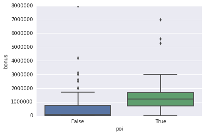


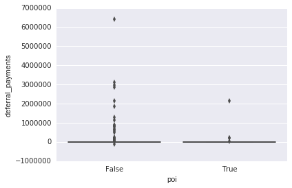


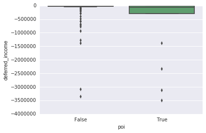


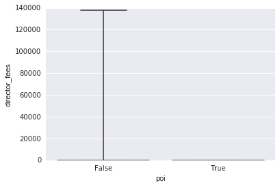


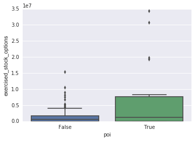


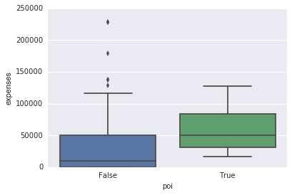


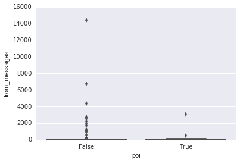


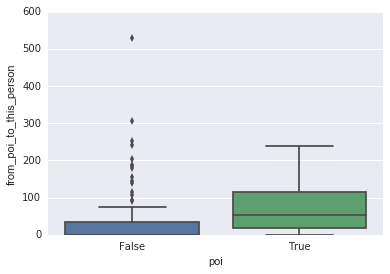


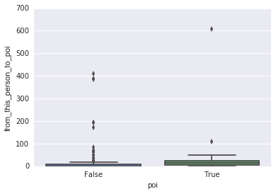


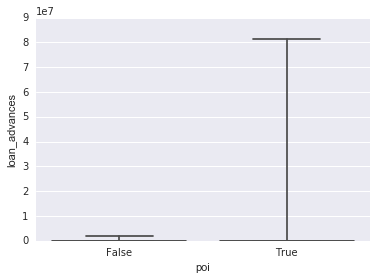


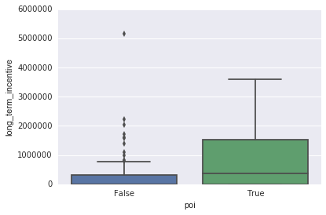


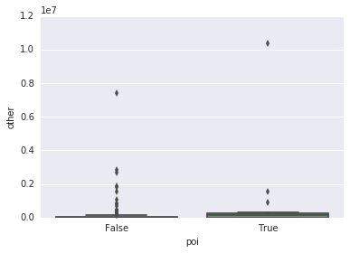


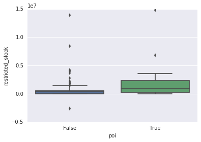


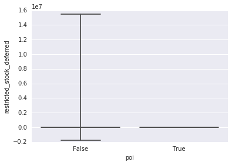


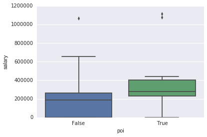


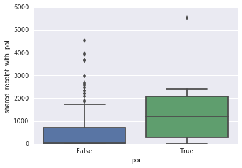


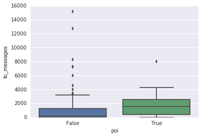


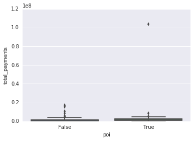


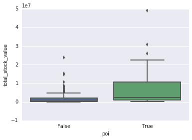


```python

```
